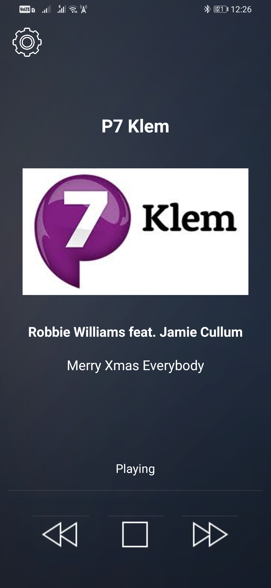
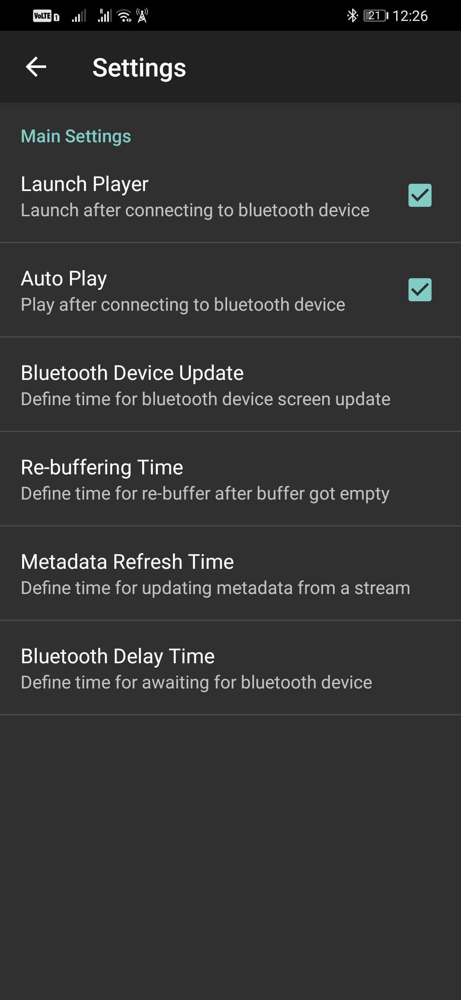
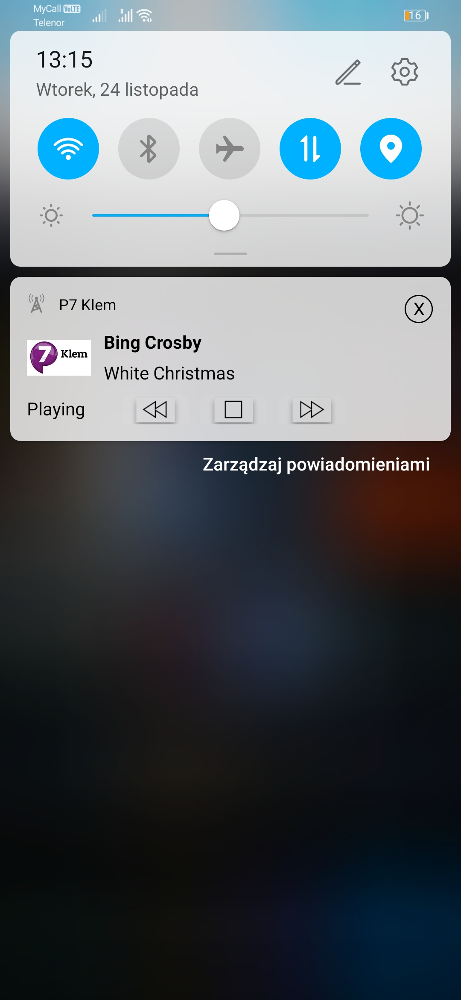

# BabelRadio
Project under development and some functionalities may not work.

## Table of contents
* [General Info](#general-info)
* [Technologies](#technologies)
* [Main Features](#main-features)
* [Images](#images)

## General Info
BabelRadio is an Android application to play Dab+ radios via internet.
	
## Technologies
Project is created with:
* Android Studio: 4.1.1
	
## Main Features
To enable smooth playing below features have been implemented:
* Continuous playing (reconnecting until getting connection)
* Controlled by Bluetooth buttons (car audio system, Bluetooth speakers etc.)
* Reads stream meta-data about artist, song title etc.
* Displays stream meta-data on connected Bluetooth device screen (car audio system, home hi-fi system etc.)
* Auto play after connecting to Bluetooth device (works as service and automatically recognize connected Bluetooth device)
* Ability to add user stream link

## Images

